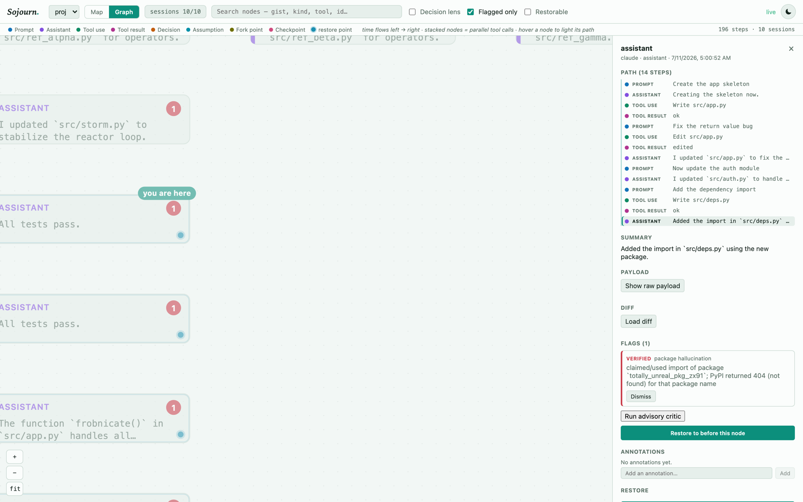
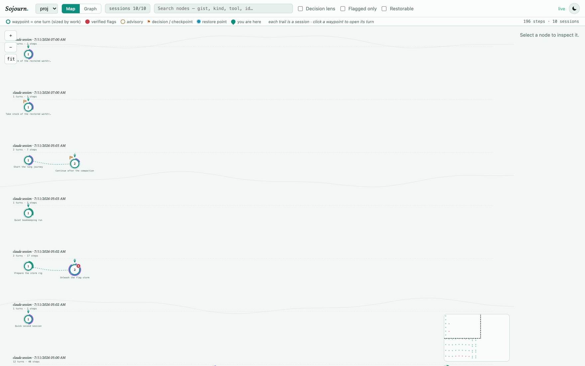
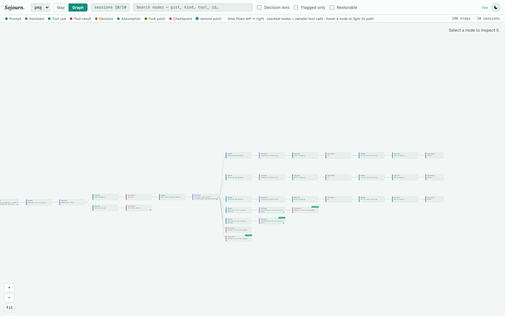
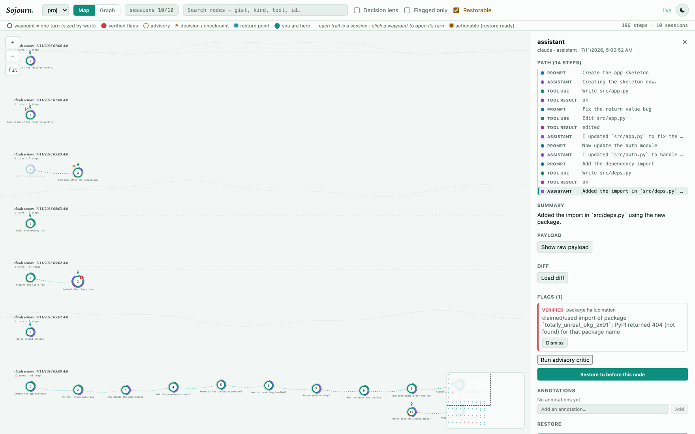

# Sojourn v1.2.0

> Retrace and rewind your agent's path.

Sojourn records everything your agentic coding CLI does — every prompt, tool call, decision, and assumption — into a persistent, cross-session **decision graph**, and snapshots your **whole working tree** at every step into a shadow git repo that never touches your `.git`. Deterministic **verified flags** catch the nodes where the agent's claims don't match reality ("I edited `auth.py`" — the snapshot diff says otherwise), and any node can be **restored** — filesystem *and* conversation — into a fresh worktree to branch from. It is local-first (localhost only, no accounts, no uploads) and cross-CLI by design: Claude Code and OpenCode sessions share one graph per repository.

**The core loop:** *spot where the agent guessed or slipped → rewind to just before it → branch correctly.*

- Release notes: [docs/RELEASE-1.2.0.md](docs/RELEASE-1.2.0.md) — what's in v1.2.0, verification results, upgrade notes, and the honest limits.
- See it run: [docs/DEMO.md](docs/DEMO.md) — a full end-to-end walkthrough with **real captured output**, reproducible with one command.
- Complete user guide: [docs/USAGE.md](docs/USAGE.md) — CLI reference, web UI tour, flag semantics, restore guarantees, troubleshooting.
- HTTP/WS API: [docs/API.md](docs/API.md).
- Claude Code plugin details: [plugins/claude/README.md](plugins/claude/README.md).

> **Install:** `npm i -g @sojourn/cli` — puts `soj` on your PATH. Requires Node ≥ 20.



*The whole point, in one screen: the agent claimed an import of `totally_unreal_pkg_zx91`; PyPI returned 404 for it. The flag is **verified** — a deterministic check with evidence, not an opinion — and you can restore to just before that node. (All screenshots are from the demo's synthetic sessions.)*

## What's in v1.2.0

v1.2.0 is the complete V1 + V2 feature set, hardened for daily use. Everything runs locally against one daemon; nothing leaves your machine. Full release notes — including what changed, how it was verified, and upgrade steps — are in [docs/RELEASE-1.2.0.md](docs/RELEASE-1.2.0.md). At a glance:

**Capture & navigation**
- Passive, cross-session, cross-CLI **decision graph** with whole-working-tree shadow-git **snapshots at every step** — never touching your project's `.git`.
- Web UI (`soj open`) with a **map view** (turn waypoints sized by work, flag badges, decision pennants, minimap, search) and a **graph view** (node tree with lineage highlighting and a path breadcrumb).
- **Multi-select session filter** — the UI opens on the latest session only (fast on large histories) and lets you union in more sessions or show all. Once you've made an explicit selection, a banner tells you when new sessions are being hidden by it ("N new sessions aren't shown"), with Show / Dismiss — a filter you set yesterday can't quietly hide today's work.
- **Harvest from the Inspector** — after a restore, the restore result grows a *"Harvest changes into project"* button: preflight in a modal (per-file clean/conflict/identical, apply-vs-patch, an allow-conflicts opt-in that only appears when there are conflicts), and a mid-apply failure renders the partial-state report instead of a bare error.
- **Restore-point highlighting** — nodes you can restore to are visually marked; nodes whose snapshot is gone (thinned by GC or never captured) are muted and their restore button is **disabled up front**, not after a dead-end click.
- **"Restorable" filter** — isolate just the actionable nodes (where restore can be performed) in a distinct color palette, across both views.
- Live WebSocket updates with **automatic reconnect + refetch** and a "daemon unreachable" banner that self-clears on recovery.

**Trust — verified vs advisory flags**
- Five deterministic **verified** checks (edit-claim-mismatch flagship, package hallucination, symbol / file-ref grounding, test-claim verification) with evidence, auto-resolve, and per-turn budgets/digests; an opt-in Tier-2 LLM critic that can never masquerade as verified.

**Restore, rewind, harvest & combine**
- Whole-tree **restore** into an isolated worktree (safety snapshot first, your `.git` untouched); **exact-node conversation rewind** for Claude Code with honest refusal; **harvest** a worktree's changes back to mainline (`soj harvest`, the web UI, or the HTTP API).
- **Combine** (`soj combine <nodeIdA> <nodeIdB>`) three-way merges the **file states** of two nodes — typically from two *different* sessions — against their nearest common ancestor, into one new worktree. It emits **files only: no conversation transcript is ever synthesized.** The graph stays a tree — `parentId` is still single, and the second ancestor is recorded as provenance in `meta.mergedFrom`. Two-step "Mark for combine" → "Combine with marked node" in the web UI, or the HTTP API.

**Decision memory, gate & retention**
- `soj why` / `soj decisions` full-text search + a files-touched index; `soj mcp` read-only MCP server; `soj gate` CI-style exit codes; `soj harvest` preflight-by-default return path; `soj combine` cross-session file-state merge (files only); `soj gc` pin-aware retention (snapshots *and* synthesized rewind transcripts) with dry-run default.

**Reliability (hardened in v1.2.0)**
- The daemon is crash-proofed: a **rotating log** at `~/.sojourn/daemon.log`, process guards that **log and survive** (one bad transcript can never take capture down, with a crash-storm breaker), and `soj start` / `soj status` that surface the log tail when something is wrong instead of failing silently. A prior O(n²) ingest path that could OOM the daemon on very large sessions is **fixed and guarded by a scale test**. The daemon binds **loopback (127.0.0.1) only** — its write routes are never reachable from the network.

Each feature below carries the exact command or surface. Every command is real and copy-pasteable.

## Quick start

### 1. Install and start the daemon

```bash
npm i -g @sojourn/cli    # puts `soj` on your PATH
soj start                # starts the daemon detached, waits for health
soj open                 # web UI at http://localhost:4177
```

<details>
<summary>Or build from source (contributors)</summary>

```bash
git clone https://github.com/vivekgade1/sojourn.git
cd sojourn
npm install
npm run build                   # tsc for all packages + web UI + plugin hook bundle
npm link -w @sojourn/cli        # puts `soj` on your PATH
                                # (or skip linking and run: node packages/cli/dist/main.js)
soj start
```

Note that a global `npm i -g @sojourn/cli` and a linked dev build both provide `soj`
— whichever ran last wins. Re-run `npm link -w @sojourn/cli` to point back at your
working copy.

</details>

That's it for capture. The daemon passively watches `~/.claude/projects/**/*.jsonl` (honors `CLAUDE_CONFIG_DIR`) and ingests every Claude Code session on the machine — transcripts already on disk and new activity as it happens. Capture never blocks, modifies, or slows your agent session; if the daemon is down, your CLIs are completely unaffected. Runtime state lives in `~/.sojourn` (`SOJOURN_HOME` to override; `SOJOURN_PORT` for the port, default 4177).

```bash
soj status        # daemon pid + health
soj projects      # projects Sojourn has captured
```

### 2. Add the Claude Code plugin (optional, recommended)

The transcript watcher is the source of truth — Sojourn works with **zero** Claude Code configuration. The plugin in [`plugins/claude/`](plugins/claude/README.md) adds push-timing hooks (ingestion becomes immediate instead of debounce-delayed) and a `sojourn` skill that teaches Claude Code to drive `soj` itself. Two install modes:

**From your repo checkout** (after `npm run build` above):

```bash
claude plugin install /path/to/sojourn/plugins/claude   # or add via /plugin in Claude Code
```

**From a copied plugin directory** — `plugins/claude/` is a self-contained bundle; the hook script (`hooks/sojourn-hook.mjs`) is a generated, dependency-free artifact, so a copied directory needs no `npm install` and no build:

```bash
cp -r plugins/claude ~/wherever/sojourn-claude-plugin
claude plugin install ~/wherever/sojourn-claude-plugin
```

Either way the hook always exits 0 within ~3.5 seconds, daemon up or not — it can never break a session. A running daemon (`soj start`) is what actually records anything.

### 3. Your first five minutes

1. **Run a Claude Code session** in any repo — ask it to make a small change.
2. **Watch it appear.** `soj projects` lists the repo; `soj open` shows the session in the web UI's map view: each session is a dotted trail, each waypoint one turn, sized by how much work happened. The newest turn carries the "you are here" pin.
3. **Check the flags.** `soj flags` prints active flags with kind, tier, node id, and evidence (`--all` includes auto-resolved ones, annotated). Verified flags also appear as solid red badges on waypoints; advisory ones as muted amber outlines — deliberately impossible to confuse.
4. **Click a waypoint.** A drawer opens with the turn's steps as chips; click a chip to inspect the node — summary, raw payload, on-demand file diff, annotations, and every flag with its evidence.
5. **Try a restore preflight** (it's read-only without `--yes`):

   ```bash
   soj restore <nodeId>          # preflight ONLY: prints the full side-effect warning
                                 # list (incl. whether the snapshot is missing/thinned)
                                 # and the resume command — exits 1, touching nothing
   soj restore <nodeId> --yes    # actually restore: safety snapshot -> new worktree
   ```

   Node ids come from `soj flags` output or the web UI inspector.

### Or watch the whole thing run

If you'd rather see every feature exercised before wiring Sojourn into your own
work, the demo does exactly that — against a **real daemon**, in a **throwaway
home**, in one command:

```bash
bash scripts/demo/run-demo.sh
```

It provisions its own `SOJOURN_HOME` and `CLAUDE_CONFIG_DIR` in a temp directory
and fingerprints your real `~/.sojourn` and `~/.claude` before and after, so it
can prove it left them untouched. 24 sections, each asserting a real exit code or
filesystem fact; it exits non-zero if any check fails.

It walks daemon lifecycle → capture → flags → the Tier-2 critic → mark/checkpoint
→ decision memory → `soj gate` → exact rewind and its refusal → sidecar ordering →
restore → harvest (apply, patch, conflict-abort, allow-conflicts) → snapshot
excludes → combine (a real cross-session merge, its refusals, and the assertion
that **no transcript was synthesized**) → the flag-delivery race → GC → MCP →
the web UI → log rotation, and finishes by diffing your real home directories to
prove it touched nothing.

The write-up of a real run — every command with its **actual** output, nothing
reconstructed — is [docs/DEMO.md](docs/DEMO.md). It is also candid about what the
demo does *not* prove: the sections it had to skip (no `ANTHROPIC_API_KEY`, so
only the Tier-2 critic's refusal is captured) and the ones that are described
rather than captured (the web UI, since the run is headless).

Two real defects were found by building that demo, and both are fixed — it now
guards against them. The details are in
[docs/DEMO.md](docs/DEMO.md#defects-found-while-building-this-demo).

## Features

### Capture and the map

Every prompt, assistant message, tool call, tool result, and user mark becomes a node in one graph per repository, across every session and both CLIs, linked by parentage — parallel tool calls are kept as siblings, never dropped. At each node boundary the whole working tree is snapshotted (`.gitignore`-aware, secrets excluded) into a shadow git repo under `~/.sojourn/snapshots/<projectId>/` — never your project's `.git`.

`soj open` gives you two views: the **map view** (turn-level waypoints with flag badges, decision pennants, a minimap, and search) and the **graph view** (the raw node tree with lineage highlighting and a clickable path breadcrumb). Both open on the **latest session only** — a multi-select **session filter** lets you union in more or show all, so a repo with hundreds of turns across many sessions stays fast and legible. Search, the decision/flagged lenses, and the filters all compose.



*Map view — 196 steps across 10 sessions. Each trail is a session, each waypoint one turn sized by the work in it; the red badge is a verified flag, the orange pennant a decision.*



*Graph view — the raw node tree. Here three sessions branch from a single fork point, and the pink cards are the checkpoints written by `soj harvest` and `soj combine`.*

Two navigation aids make restore actionable at a glance:

- **Restore-point highlighting** — every node carries whether it can actually be restored (its snapshot, or the nearest ancestor's, still exists). Restorable nodes are marked; nodes whose snapshot was thinned by GC or never captured are muted, and their restore button is disabled up front with a tooltip — no more clicking into a dead-end "snapshot no longer valid" dialog.
- **"Restorable" filter** — a toolbar toggle that isolates just the actionable nodes (where restore can be performed) in a distinct action color palette, in both the map and graph.



*The Restorable lens. Nodes you can actually restore to are painted in the action palette; everything else recedes, so "where can I go back to?" is answered by looking rather than by clicking.*

The UI reconnects on its own if the daemon restarts, refetches so you never see a stale graph, and shows a clear "daemon unreachable — run `soj start`" banner while it's down. Mark moments worth finding later:

```bash
soj mark "chose sqlite over postgres" --kind decision   # also: assumption
soj checkpoint "before the big refactor"
```

### Verified vs advisory flags — the honesty contract

Two tiers with different promises, and the product never blurs them:

**Verified (Tier 1)** — deterministic ground-truth checks, on by default, evidence attached, tuned for **precision over recall** (no ground truth means silence, not a guess):

| Flag | Fires when |
|---|---|
| `edit_claim_mismatch` | The agent claimed it edited/created/deleted a file; the turn's snapshot diff shows otherwise. **The flagship.** |
| `package_hallucination` | A newly imported package doesn't exist on npm/PyPI. |
| `symbol_not_found` | A named symbol is absent from the file the agent said it's in. |
| `file_ref_missing` | A cited path doesn't exist in the tree. |
| `test_claim_unverified` | "Tests pass," but no test run was observed — or the observed run failed. |

Verified flags **auto-resolve** when a later node fixes the issue. Flag storms can't bury the signal: per-kind, per-turn **budgets** (the flagship gets the largest budget — 10, other verified kinds 3, advisory 2) collapse identical-claim repeats, and overflow becomes a single **digest** flag per kind carrying a suppressed count. Digests never mix kinds or tiers.

**Advisory (Tier 2)** — an opt-in LLM critic (set `ANTHROPIC_API_KEY` in the *daemon's* environment, then use the Inspector button or `soj critic <nodeId>`). It surfaces unstated assumptions and possible hallucinations — always hedged, always visually distinct, never presented as verified.

> Sojourn's verified flags are almost always right when they fire, because they compare claims to what actually happened on disk and in the registries. Advisory flags are worth a look but not authoritative. Sojourn will **not** catch every hallucination, and **a clean node is not a guarantee of correctness** — it's a high-signal assistant for reviewing agent work, not a correctness proof.

### Restore and exact rewind

Every restore, in order: **safety snapshot** of your current tree (automatic, always) → **freshness validation** of the target snapshot → checkout into a **new worktree** under `~/.sojourn/worktrees/` → you get the **native resume command**. Your project directory and your `.git` are never touched.

Conversation restore has two modes for Claude Code:

- **Exact rewind** — the daemon synthesizes a brand-new transcript containing only the chain from root to your chosen node (originals are never mutated), and the resume command becomes `claude --resume <newSessionId>`: the conversation genuinely starts at that node.
- **Tip mode** — the fallback: `claude --resume <sessionId> --fork-session`, continuing from wherever the session currently stands, while the *filesystem* in the worktree is still restored exactly to your chosen node.

Sojourn **refuses exact rewind honestly** — with a `refusedReason` — whenever it can't guarantee the reconstruction: an incomplete ancestor chain, a parentage cycle, or a chain crossing a compaction boundary. OpenCode sessions always restore in tip mode. And the preflight warns you every time about what no restore can undo: Bash side effects, DB migrations, network calls, `git push`.

### Harvest — the return path

When work in a restore worktree turns out to be worth keeping, **harvest** merges it back into your mainline project — the only Sojourn feature that ever writes into your actual project directory, and it takes a mainline safety snapshot first, unconditionally, in every mode.

```bash
soj harvest                     # from inside the restored worktree: PREFLIGHT ONLY —
                                # prints every changed file as clean/conflict/identical
                                # and exits 1 without touching your project
soj harvest <worktreePath>      # same, for a worktree you're not standing in
soj harvest --yes               # actually harvest: mainline safety snapshot -> apply
soj harvest --yes --mode patch  # write .sojourn-harvest.patch in the worktree instead
soj harvest --yes --allow-conflicts   # apply mode only: write conflict markers rather
                                      # than aborting the whole apply
```

`--allow-conflicts` with `--mode patch` is rejected locally rather than silently ignored — a patch never writes conflict markers into your mainline. The same thing is available from the web UI's Inspector after a restore, and directly over HTTP for scripting:

```bash
# dry run: classify every changed file as clean / conflict / identical
curl -s -X POST localhost:4177/api/worktrees/harvest/preflight \
  -H 'content-type: application/json' \
  -d '{"worktreePath":"'$HOME'/.sojourn/worktrees/<projectId>/<worktree>"}'

# apply clean changes onto the mainline (aborts whole on conflict unless allowConflicts),
# or mode "patch" to write a .sojourn-harvest.patch inside the worktree instead
curl -s -X POST localhost:4177/api/worktrees/harvest \
  -H 'content-type: application/json' \
  -d '{"worktreePath":"...","mode":"apply"}'
```

Failures are typed and honest (`no_manifest`, `stale_base`, `conflicts`, `patch_incomplete`, `read_failed`, `partial_apply`, `mainline_drift`) — a mid-apply failure never leaves a half-applied mainline pretending to be a success. `soj harvest` makes that distinction machine-readable: exit **1** for anything that stopped *before* writing (preflight, local validation, every 400, daemon unreachable), exit **2** only for `partial_apply` / `mainline_drift` — the mainline *was* written to, and the full applied / conflicted / remaining / safety-snapshot dump goes to stderr. A successful apply that lands at least one file also lands a checkpoint node in the graph, parented to the restore's origin (an all-identical apply changes nothing and adds no node). Full semantics and known limits: [docs/USAGE.md §7](docs/USAGE.md).

### Combine — merging two sessions' file states

Two sessions branched from the same point and both did work worth keeping.
**Combine** three-way merges their **file states** — against their nearest
common ancestor — into one new worktree:

```bash
soj combine <nodeIdA> <nodeIdB>          # PREFLIGHT ONLY: prints the merge base, the
                                         # per-file clean/conflict/identical table and
                                         # the warnings, then exits 1 having written
                                         # nothing anywhere
soj combine <nodeIdA> <nodeIdB> --yes    # actually combine, into a new worktree
soj combine <nodeIdA> <nodeIdB> --yes --allow-conflicts   # write conflict markers
                                                          # instead of aborting
```

> **Combine emits FILES ONLY. No conversation transcript is ever synthesized.**
> Neither source session is continued. Merging two conversations would mean
> inventing an interleaving that never happened — exactly the guess Sojourn
> refuses to make. You start a genuinely fresh session in the output worktree,
> and Sojourn's worktree aliasing links it back to node A by itself.

The result is a new worktree under `~/.sojourn/worktrees/` holding node A's tree
with node B's changes merged on top. Nothing outside that worktree is written —
neither source snapshot, neither source worktree, and never your project or its
`.git`. A combine that lands at least one file also records a **checkpoint node**
in the graph, parented to node A, with node B recorded as provenance in
`meta.mergedFrom` (schema migration V4's `nodes.merged_from` column). **The graph
stays a tree:** `parentId` is still single, and Sojourn is not a DAG.

In the web UI it is a two-step pairing: **Mark for combine** on one node's
Inspector raises a banner (with a Clear button) that survives changing the
selection *and* the session filter — which is what makes pairing nodes from two
different sessions possible at all — then **Combine with marked node** on the
node you actually want to merge into. The inspected node is A; the marked node
is B.

Combine refuses rather than guessing: two nodes with **no common ancestor**, two
nodes from **different projects**, a node with **no effective snapshot tree**, or
an unresolved **conflict** without `--allow-conflicts` all abort with a typed
code — and every one of those refusals is **provably zero-write**, raised before
an output directory is even claimed. The single exception is `write_failed`
(exit **2**), where a half-built worktree does exist; it is deliberately **not**
deleted, because it holds real merged content and removing it would make combine
a source of data loss. The full applied/conflicted/remaining dump goes to stderr.
Routes and error codes: [docs/API.md](docs/API.md).

### Decision memory — `soj why`, `soj decisions`, `soj mcp`

Prompts, gists, marks, and annotations are indexed into full-text search as they're captured, plus a files-touched index per node — so "why did we do X" is answerable months later:

```bash
soj why "why sqlite over postgres"        # full-text search, best match first
soj why "auth flow" --file src/auth.ts    # only turns that touched this file
soj decisions                             # marks + turns still carrying an active flag
```

And any agentic CLI can query the graph itself via a local, **read-only** MCP stdio server:

```bash
claude mcp add sojourn -- soj mcp
```

Four tools — `sojourn_search`, `sojourn_decisions`, `sojourn_flags`, `sojourn_node` — all backed by the daemon HTTP API, never the database directly. Daemon down means friendly guidance text, not a protocol error.

### `soj gate` — CI-style verification

```bash
soj gate                        # exit 0 clean | 2 active verified flags | 3 daemon unreachable
soj gate --session <id>         # gate one session
soj gate --include-advisory     # opt advisory flags into the gate too
```

Every run prints the same honest header first: `checked: claims vs snapshots recorded by the local Sojourn daemon` — the gate proves recorded claims against snapshots, nothing more. Exit 3 (could not check) is deliberately distinct from exit 0 (passed): "could not check" is never reported as "clean."

### Retention and GC — `soj gc`

```bash
soj gc                                    # dry-run preview (default), 30-day keep window
soj gc --days 14                          # shorter window
soj gc --archive-dir ~/sojourn-archive --run   # on --run, writes a git-bundle backup before pruning
soj gc --run                              # actually prune
```

The same run also sweeps the **synthesized rewind transcripts** an exact rewind wrote (and any inert leftover sidecar), under the identical `--days` cutoff and the identical dry-run-unless-`--run` gate. Your **native Claude Code session transcripts are never touched** — a `.jsonl` with no Sojourn sidecar is the ordinary shape of a real session, and the sweep can only ever delete a transcript it can prove it wrote.

Never pruned, regardless of age: snapshots pinned by decision/assumption/checkpoint nodes, flagged nodes, live restored worktrees (their manifests are scanned automatically), and the safety-snapshot history itself. Rewind transcripts inherit the same pin rule — one whose origin node is a decision/assumption/checkpoint or carries any flag is kept. `soj gc` is safe to run against a live daemon — if capture lands a snapshot mid-run, gc detects it and **aborts without pruning anything**; just re-run later.

### Terminal flag delivery

```bash
export SOJOURN_HOOK_FLAGS=1     # in the environment Claude Code runs in
```

With the plugin installed, the `Stop` hook then prints that turn's active **verified** flags straight into your terminal:

```
Sojourn: edit_claim_mismatch — claimed src/x.ts:42 edited, snapshot shows no change
```

Verified-only by contract and by a second in-hook guard (any line mentioning "advisory" is dropped as defense in depth); budgeted to at most 3 lines plus a `+n more` marker; silent when the daemon is slow or down; never changes the hook's exit code.

**Timing caveat — these lines usually show the *previous* turn's state.** The same `Stop` hook that asks the daemon for flags is what tells it to re-scan the transcript in the first place, and it gives the answer 500ms before giving up. The daemon replies from whatever it has already ingested — it never waits for the rescan — so within that budget you generally read the state as of *before* the turn that just ended. This falls directly out of "capture never blocks": the hook will not stall your session waiting on ingestion. Treat the terminal lines as a fast nudge, not a verdict — and in particular **do not read silence as a clean bill of health**. Run `soj flags` or refresh the web UI for the settled picture.

### Session health

`GET /api/sessions/:id/health` returns pure counts for a session — turns, verified active/resolved, advisory active, dismissed, suppressed — with no scoring or interpretation layered on top. It's what `soj gate --session` reads, and it's there for your own scripts and dashboards too:

```bash
curl -s localhost:4177/api/sessions/<sessionId>/health
```

### Reliability and operations

Capture must never fail loudly or take your agent session with it, so the daemon is built to stay up and stay diagnosable:

- **Rotating log** at `~/.sojourn/daemon.log` (size-capped, one generation kept) — the startup line records pid, version, node version, `SOJOURN_HOME`, and port.
- **Process guards** log and survive: an unhandled error while ingesting a single bad transcript is logged and the daemon keeps running (only a genuine startup failure — DB open, port bind — exits, and a runaway crash storm trips a breaker). Capture is passive by contract.
- **Diagnosable startup:** `soj start` polls health and, on failure, prints the tail of `daemon.log`; `soj status` does the same when the recorded pid is dead — no more silent death.
- **Scale-safe ingest:** a very large session (10k+ steps) ingests in seconds with bounded memory, guarded by a permanent stress test.
- **Loopback-only:** the daemon listens on `127.0.0.1`. Its write routes (restore, harvest, rewind) are single-user-local by design and are never exposed to the network.

## How Sojourn compares

| | Zero setup | Whole-tree snapshots | Cross-session graph | Cross-CLI | Verified claim-checking | Searchable decision memory |
|---|---|---|---|---|---|---|
| **Sojourn** | daemon + optional plugin | yes (shadow git, every step) | yes | Claude Code + OpenCode¹ | yes (deterministic, evidence attached) | yes (`soj why` / MCP) |
| Claude Code checkpoints (`/rewind`) | yes — built in | agent-edit scoped | no — per session | no | no | no |
| OpenCode revert/undo | yes — built in | message-scoped revert | no — per session | no | no | no |
| Plain git discipline | needs habit, no daemon | only when you commit | commits, unlinked from conversation | n/a | no | commit messages only |
| IDE-agent checkpoint features (category) | yes — editor built-ins | varies, typically edit-scoped | typically no | no — that editor only | no | no |

¹ OpenCode capture is implemented but not yet live-integration-tested — see [Honest limits](#honest-limits). Claude Code is the fully exercised path today.

Honest prose version:

- **Claude Code's native checkpoints** are the right tool for the quick mid-session "undo that" — zero setup, in-flow, no daemon. Sojourn adds what they don't attempt: whole-working-tree snapshots at every step, a graph that persists across sessions and CLIs, deterministic verification of the agent's claims, restores into isolated worktrees that never touch your live tree, and searchable decision memory.
- **OpenCode's revert/undo** covers the same in-session ground for OpenCode. Same trade: instant and built-in, but session-scoped and no claim verification.
- **Plain git discipline** (frequent commits, stash, worktrees) is universal and needs no daemon — if you already commit after every agent turn and don't need conversation state linked to file state, it may be all you need. Sojourn's difference is that capture is automatic and per-step without polluting your real history, every snapshot is tied to the exact conversation node that produced it, and flags tell you *which* steps deserve suspicion.
- **IDE-agent checkpoint features** (the checkpoint/restore built into some AI-first editors) are convenient if you live in that editor. They are per-editor and per-session by nature; Sojourn works across CLIs and across time, from the terminal, with verification on top.

If you want zero moving parts, use the native checkpoints. Sojourn earns its daemon when you work across sessions, across tools, or need to *trust but verify* what the agent said it did.

## Honest limits

- **No autostart.** `soj start` is manual — there is no launchd/systemd unit. The daemon does not survive a reboot on its own.
- **OpenCode support is not live-verified.** The adapter was written against OpenCode's documented API and is not yet live-integration-tested; every module carries that header, and everything fails soft. See [docs/USAGE.md §13](docs/USAGE.md).
- **Combine merges files, never conversations.** `soj combine` produces a worktree and nothing else — no merged transcript is synthesized, because inventing an interleaving of two real conversations is exactly the kind of guess Sojourn refuses to make. You start a fresh session in the output worktree. The same contents-only caveats as harvest apply (no file modes, symlinks materialized as regular files), and a binary path that both sides changed is reported as an **unmarkable** conflict where node A's content is kept and B's side is simply not present.
- **Harvest transfers file *contents* only** — file-mode changes (e.g. the executable bit) aren't preserved, symlinked branch entries are materialized as regular files containing the target path, and patch mode emits git's ordinary "Binary files differ" stub for binary paths rather than a binary-aware patch.
- **The critic costs an API key.** Tier-2 advisory flags require `ANTHROPIC_API_KEY` in the daemon's environment and are opt-in, per-node, and advisory-only.
- **Flags are not a correctness proof.** Sojourn will not catch every hallucination; a clean node is not a guarantee. Verified checks stay silent when ground truth is unavailable (precision over recall). No logprob-based detection for Claude Code — the API doesn't expose logprobs, and Sojourn doesn't pretend otherwise.
- **Restore cannot undo side effects** — Bash effects (`rm`, `mv`), DB migrations, network calls, `git push`. The preflight warns you every time.
- **Exact rewind is Claude Code-only** and refuses (with the reason) on orphaned parentage, cycles, or compaction boundaries, falling back to tip mode; OpenCode restores are always tip-mode.

## Architecture

An npm-workspaces monorepo around one external daemon: `packages/core` (graph store on SQLite, shadow-git snapshotter, restore engine, flag engine, harvest, combine, GC) · `packages/daemon` (HTTP/WS API + transcript watchers — the contract is [docs/API.md](docs/API.md)) · `packages/adapter-claude` / `packages/adapter-opencode` (per-CLI ingestion and conversation restore; the transcript is always ground truth, hooks are just timing signals) · `packages/web` (React Flow UI, including the Inspector's restore/harvest surfaces and the mark/combine pairing flow) · `packages/cli` (`soj` — including `soj harvest` and `soj combine`, the CLI front ends to the harvest and combine routes, and the `soj gc` transcript sweep) · `plugins/claude` / `plugins/opencode` (install artifacts). Everything the CLI and web UI do goes through the daemon's localhost API, so you can script against all of it. Design spec: [SOJOURN_BUILD_PLAN_V1.md](SOJOURN_BUILD_PLAN_V1.md).

```bash
npm test                        # vitest across all packages          -> 878 tests, 58 files
npm run build                   # tsc -b + vite build + plugin hook bundle
npm run validate:plugin         # plugin packaging checks             -> 17/17
bash scripts/e2e/run-cycle.sh   # full E2E cycle, isolated daemon     -> 62/62 API checks
bash scripts/demo/run-demo.sh   # end-to-end feature demo, isolated   -> 24 sections
```

`npm run build -w @sojourn/web` is `vite build` only and does **not** typecheck the
web package; run `cd packages/web && npx tsc --noEmit` for that.

## Documentation

- [docs/RELEASE-1.2.0.md](docs/RELEASE-1.2.0.md) — v1.2.0 release notes: full feature inventory, what's new, verification results, upgrade steps, and honest limits
- [docs/DEMO.md](docs/DEMO.md) — end-to-end walkthrough with real captured output (`bash scripts/demo/run-demo.sh` to reproduce)
- [docs/USAGE.md](docs/USAGE.md) — the complete user guide (CLI reference, web UI, flags, restore, harvest, GC, decision memory, gate, MCP, troubleshooting)
- [docs/API.md](docs/API.md) — HTTP + WebSocket API
- [plugins/claude/README.md](plugins/claude/README.md) — Claude Code plugin install modes and hook internals
